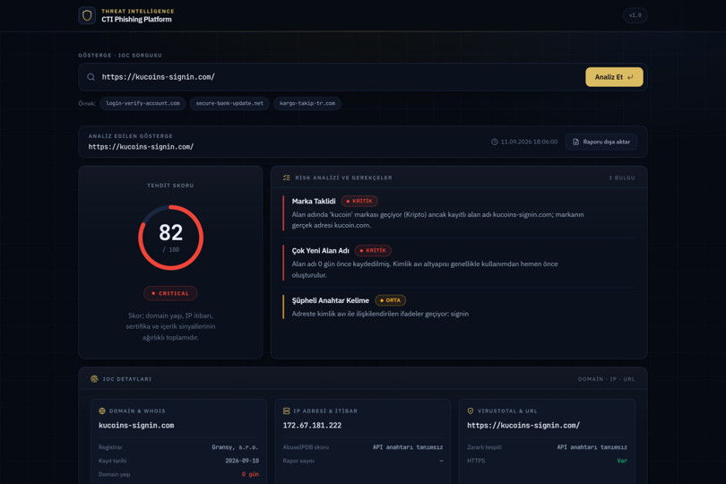
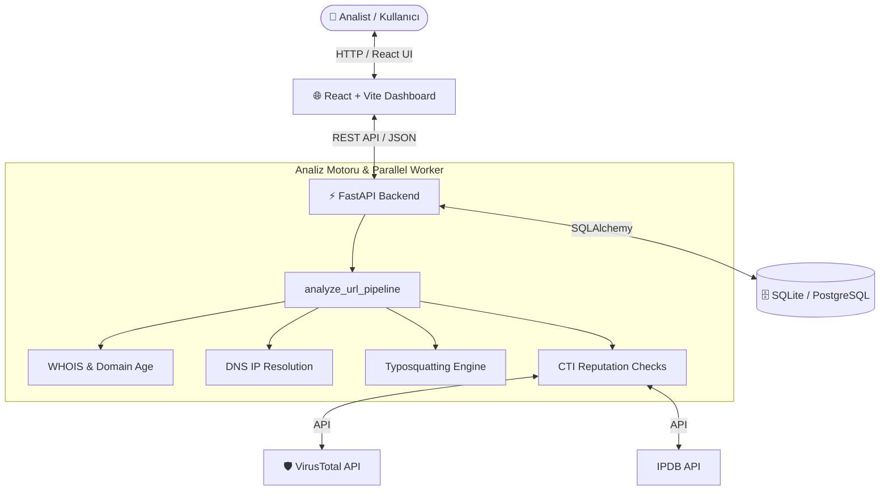

# 🛡️ Phishing Campaign Intelligence Platform (CTI Phishing Platform)


**Phishing Campaign Intelligence Platform**, şüpheli URL ve alan adlarını (IOC - Indicator of Compromise) gerçek zamanlı olarak analiz eden, tehdit skorlaması yapan ve gerekçelendirilmiş siber tehdit istihbaratı (CTI) raporları sunan modern bir güvenlik platformudur.

---

## 📸 Ekran Görüntüsü



> *Görsel: Şüpheli bir alan adının (`https://kucoins-signin.com/`) analizi sonrasında elde edilen Tehdit Skoru (82/100 - CRITICAL), Marka Taklidi ve Domain Yaşı gerekçeleri ile VirusTotal & AbuseIPDB entegrasyon detayları.*

---

## 🔥 Öne Çıkan Özellikler

- **🎯 Açıklanabilir Tehdit Skoru (0 - 100):** Sezgisel kurallar, WHOIS verileri, TLD riskleri ve şüpheli anahtar kelimeler ile ağırlıklı risk hesaplaması (`CRITICAL`, `HIGH`, `MEDIUM`, `LOW`).
- **🕵️ Marka Taklidi & Typosquatting Tespiti:** Kripto borsa, bankacılık ve popüler servislerin marka isimlerini taklit eden oltalama (phishing) adreslerinin tespiti.
- **🛡️ MITRE ATT&CK® Haritalaması:** Tespit edilen tehditlerin ilgili taktik ve tekniklerle ilişkilendirilmesi (Örn: `T1566.002 - Spearphishing Link`, `T1056.003 - Credential Access`).
- **🌐 Dahili & Harici CTI Servis Entegrasyonları:**
  - **VirusTotal API:** Zayıflık ve zararlı tespit analizleri.
  - **AbuseIPDB API:** IP adresi itibarı ve kötüye kullanım raporları.
  - **WHOIS & IP Coğrafi Konumu:** Kayıt tarihi, alan adı yaşı ve barındırma sunucusu tespiti.
- **⚡ Eşzamanlı (Parallel) Analiz Hattı:** `ThreadPoolExecutor` kullanılarak WHOIS, DNS çözümleme ve itibar sorgularının milisaniyeler içinde paralel yürütülmesi.
- **📊 Kampanya Yönetimi & Raporlama:** İncelenen IOC'lerin kaydedilmesi, geçmiş analizlerin sorgulanması ve JSON formatında dışa aktarılması.

---

## 🛠️ Teknoloji Yığını

| Katman | Teknoloji / Kütüphane | Açıklama |
| :--- | :--- | :--- |
| **Backend** | Python 3.11, FastAPI, Uvicorn | Yüksek performanslı asenkron REST API servisi |
| **Frontend** | React 18, Vite, TailwindCSS | Modern dark-mode siber güvenlik gösterge paneli |
| **Veritabanı** | SQLite / PostgreSQL | Geliştirmede hafif SQLite, Docker üzerinde PostgreSQL |
| **ORM & Doğrulama** | SQLAlchemy 2.0, Pydantic v2 | Veritabanı modeli yönetimi ve şema doğrulamaları |
| **Kapsayıcı** | Docker & Docker Compose | Multi-stage build ile optimize edilmiş konteynerizasyon |

---

## 🏗️ Sistem Mimarisi



---

## 🚀 Kurulum ve Çalıştırma

Projeyi çalıştırmak için **iki farklı yöntem** bulunmaktadır.

### Yöntem 1: Docker Compose ile Çalıştırma (Önerilen)

Bilgisayarınızda [Docker Desktop](https://www.docker.com/products/docker-desktop/) kuruluysa tek komutla tüm servisleri ayağa kaldırabilirsiniz.

1. Proje dizinine gidin:
   ```bash
   cd Phishing-Campaign-Intelligence-Platform-main
   ```

2. `.env` dosyasını hazırlayın:
   ```bash
   cp .env.example .env
   ```

3. Konteynırları derleyin ve başlatın:
   ```bash
   docker-compose up --build
   ```

Servisler hazır olduğunda:
- **Frontend Dashboard:** [http://localhost:5173](http://localhost:5173)
- **Backend & Swagger API Docs:** [http://localhost:8000/docs](http://localhost:8000/docs)

---

### Yöntem 2: Yerel Ortamda Manuel Çalıştırma (Python + Node.js)

#### 1. Backend (FastAPI) Başlatılması

```bash
# 1. Proje klasörüne gidin
cd Phishing-Campaign-Intelligence-Platform-main

# 2. .env dosyasını oluşturun
cp .env.example .env

# 3. Python sanal ortamı oluşturun ve aktif edin
python -m venv venv
# Windows için:
.\venv\Scripts\activate
# Linux/macOS için:
source venv/bin/activate

# 4. Bağımlılıkları yükleyin
pip install -r backend/requirements.txt

# 5. FastAPI sunucusunu başlatın
python -m uvicorn backend.main:app --reload --port 8000
```

#### 2. Frontend (React + Vite) Başlatılması

Yeni bir terminal penceresinde:

```bash
# 1. Proje klasörüne gidin
cd Phishing-Campaign-Intelligence-Platform-main

# 2. NPM paketlerini yükleyin
npm install

# 3. Geliştirme sunucusunu başlatın
npm run dev
```

---

## 🔑 Ortam Değişkenleri (.env)

Projenin kök dizininde yer alan `.env` dosyası konfigürasyon parametrelerini barındırır:

```env
# Veritabanı Bağlantısı (SQLite veya PostgreSQL)
DATABASE_URL=sqlite:///./cti_platform.db

# Harici CTI API Anahtarları (İsteğe bağlı - Ücretsiz hesaplardan temin edilebilir)
VIRUSTOTAL_API_KEY=your_virustotal_api_key_here
ABUSEIPDB_API_KEY=your_abuseipdb_api_key_here

# Sunucu Portu
PORT=8000
```

---

## 📡 API Uç Noktaları (Endpoints)

| Yöntem | Endpoint | Açıklama |
| :--- | :--- | :--- |
| `POST` | `/analyze/url` | Verilen URL için tam CTI analizi ve risk skorlaması yapar |
| `GET` | `/ioc` | Kayıtlı tüm Tehdit Göstergelerini (IOC) listeler |
| `GET` | `/ioc/{ioc_id}` | Belirli bir IOC'nin detaylarını getirir |
| `POST` | `/ioc` | Yeni bir IOC kaydı oluşturur |
| `GET` | `/campaigns` | Oltalama kampanyalarını ve ilişkili verileri listeler |
| `GET` | `/health` | Servis sağlık durumunu ve entegrasyon modüllerini kontrol eder |

Etkileşimli Swagger dokümantasyonu için sunucu çalışırken `http://localhost:8000/docs` adresini ziyaret edebilirsiniz.

---

## 📂 Proje Dizin Yapısı

```
Phishing-Campaign-Intelligence-Platform/
├── backend/                  # FastAPI Arka Plan Servisleri
│   ├── api/                  # API Rota Tanımları (analyze, ioc, campaign)
│   ├── core/                 # Tehdit Analiz Motoru (WHOIS, Typosquat, Reputation)
│   ├── models/               # SQLAlchemy Veritabanı Modelleri & DB bağlantısı
│   ├── schemas/              # Pydantic Veri Doğrulama Şemaları
│   ├── config.py             # Ayarlar ve Ortam Değişkenleri
│   └── main.py               # FastAPI Uygulama Giriş Noktası
├── src/                      # React Frontend Uygulaması
│   ├── api/                  # Backend API İstemcisi
│   ├── components/           # UI Bileşenleri (ThreatScoreCard, ReasonsList, vb.)
│   ├── App.jsx               # Ana Dashboard Sayfası
│   └── index.css             # TailwindCSS Stiller
├── docs/                     # Görseller ve Dokümantasyon Belgeleri
│   └── dashboard.png         # Örnek Ekran Görüntüsü
├── .env.example              # Örnek Çevre Değişkenleri Dosyası
├── Dockerfile                # Frontend / Production Docker Yapılandırması
├── docker-compose.yml        # Multi-Container Orchestration (DB + Backend + Frontend)
├── package.json              # Node.js Bağımlılıkları ve Komutları
└── README.md                 # Proje Dokümantasyonu
```

---

## 📝 Lisans

Bu proje [MIT Lisansı](LICENSE) altında lisanslanmıştır. Güvenlik araştırmaları ve eğitim amaçlı kullanıma uygundur.
